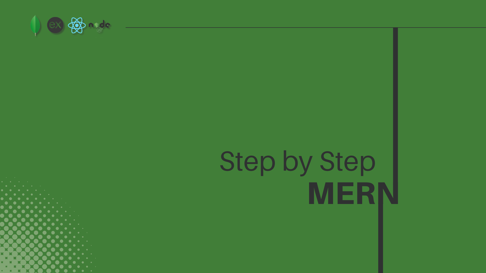

---

1. ## Setup Node.js and npm

-   Install **_Node_** and **_npm_**
-   https://nodejs.org/en (LTS Recommended)

2. ## Initialize the Project

-   First create a folder called `server` or `backend` and navigate to it.

```bash
mkdir backend
cd backend
```

-   Open your terminal and run `npm init -y` to create a `package.json` file.

3. ## Install Dependecies

-   Install necessary dependencies using the following commands

```javascript
npm i express mongoose cors dotenv
```

```javascript
npm i <dependencies> -D
```

4. ## Add ES Modules

-   In your `package.json` add `"type": "module"` to ensure that you have access to the functionality provided by these modules throughout your application.
-   ES Modules (ECMAScript Modules) are a way to organize code into separate files or modules. This method allows you to import/export functionality between these modules.

5. ## Set up Server (Node.js & Express)

-   Create a file `server.js` and set up a basic Express server
-   Also add a `.env` file to manage environment variables

```bash
touch server.js .env
```

### .env

```bash
PORT=5000
```

### server.js

```javascript
import express from "express";
import cors from "cors";
import dotenv from "dotenv";

// Managing the .env file
dotenv.config();

const app = express();
const { PORT } = process.env;

// Listen
app.listen(PORT, () => {
    console.log(`Server is running at http://localhost:${PORT}`);
});
```

7. ## Add your basic Middlewares

```javascript
// Middleware that allows browsers to accept data from this server
app.use(cors());
// Middlewares that accepts urlencoded from data request
app.use(express.urlencoded({ extended: true }));
// Middleware that accepts json format data request
app.use(express.json());
```

8. ## Folder Structure

-   We are going to follow the **MVC (Model-View-Controller)** pattern for our project structure.
-   **MVC** is a _software design pattern_ that divides the application into three interconnected components: the model, the view, and the controller.
-   This pattern helps to achieve separation of concerns.
-   **Model:** Responsible for managing the data of the application. It receives user input from the controller.
-   **View:** The user interface of the application. It displays the data using the model to the user and also enables them to modify the data.
-   **Controller:** Acts as an interface between Model and View components to process all the business logic and incoming requests, manipulate data using the Model component, and interact with the Views to render the final output.

```
backend/
|-- config/
|   |-- connectDB.js
|-- controllers/
|   |-- itemController.js
|-- middleware/
|   |-- asyncHandler.js
|   |-- errorHandler.js
|-- models/
|   |-- ItemModel.js
|-- routes/
|   |-- itemRouter.js
|-- .env
|-- .gitignore
|-- package.json
|-- seeder.js
|-- server.js
```

- For that we can create a folder structure like this.

```bash
cd backend
mkdir config controllers middleware models routes
touch .gitignore seeder.js
```

9. ## Connect to MongoDB

-   Use `mongoose` to connect your Express server to MongoDB
-   Save your `URI`in the `.env` file
-   Create a connection
-   Call this connection in your `server.js`

### .env

```bash
MONGODB_URI=your_mongodb_uri
```

### config/connectDB.js

```javascript
import mongoose from "mongoose";
import dotenv from "dotenv";

dotenv.config();

// Get the MONGODB_URI from the .env file
const { MONGODB_URI } = process.env;

// Connect to the MongoDB
const connectDB = async () => {
    try {
        // Connect to the MongoDB
        const conn = await mongoose.connect(MONGODB_URI);
        // Log the connection host if the connection is successful
        console.log(`<< MongoDB Connected: ${conn.connection.host}`);
    } catch (error) {
        // Log the error message if the connection is failed
        console.error(":: Database Not Connection");
    }
};

export default connectDB;
```

-   Ensure to include your `.env` file in the `.gitignore` to safeguard sensitive information like API keys, passwords, or ports from being exposed.

### .gitignore

```bash
node_modules
.env
```

-   Call the `connectDB` function in your `server.js`

### server.js

```javascript
import express from "express";
import cors from "cors";
import dotenv from "dotenv";

// Managing the .env file
dotenv.config();

// Import the connectDB function
import connectDB from "./config/connectDB.js";

// Connect to the MongoDB
await connectDB(); 

const app = express();
const { PORT } = process.env;

// Middleware that allows browsers to accept data from this server
app.use(cors());
// Middlewares that accepts urlencoded from data request
app.use(express.urlencoded({ extended: true }));
// Middleware that accepts json format data request
app.use(express.json());

// Listen to the PORT
app.listen(PORT, () => {
    console.log(`Server is running at http://localhost:${PORT}`);
});
```
